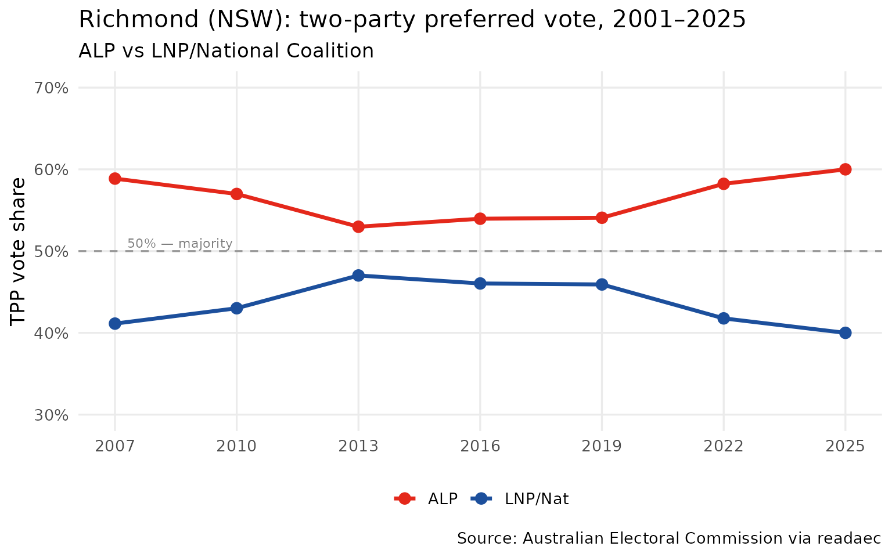
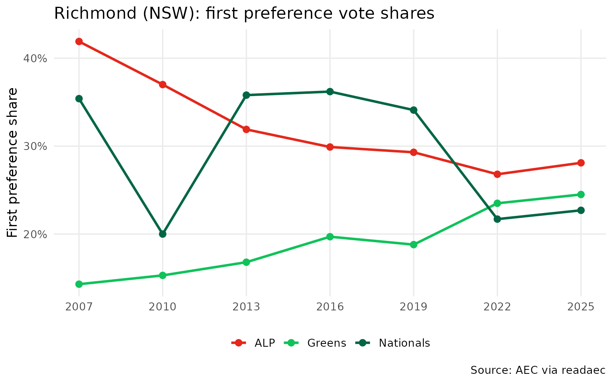
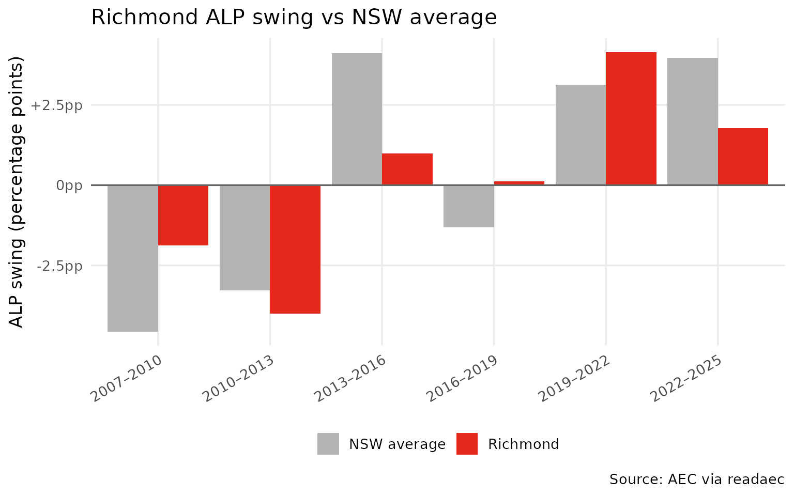

# Case study: Richmond electorate (2001–2025)

Richmond is a federal electorate in northern New South Wales, covering
the Northern Rivers region including Ballina, Lismore, Byron Bay, and
Tweed Heads. Historically a Labor–National marginal, it has been
contested by the Nationals, Labor, and (more recently) teal/independent
candidates.

This vignette walks through a complete single-electorate analysis using
readaec.

``` r
library(readaec)
library(dplyr)
library(ggplot2)
library(purrr)
```

------------------------------------------------------------------------

## 1. Available elections

Start by confirming which elections we have data for.

``` r
list_elections()
#>   year event_id       date               type has_downloads
#> 1 2001    10822 2001-11-10            general         FALSE
#> 2 2004    12246 2004-10-09            general         FALSE
#> 3 2007    13745 2007-11-24            general          TRUE
#> 4 2010    15508 2010-08-21            general          TRUE
#> 5 2013    17496 2013-09-07            general          TRUE
#> 6 2016    20499 2016-07-02 double_dissolution          TRUE
#> 7 2019    24310 2019-05-18            general          TRUE
#> 8 2022    27966 2022-05-21            general          TRUE
#> 9 2025    31496 2025-05-03            general          TRUE
```

------------------------------------------------------------------------

## 2. Two-party preferred trend

Pull the TPP result for Richmond in every election since 2001. The
[`get_tpp()`](https://charlescoverdale.github.io/readaec/reference/get_tpp.md)
function returns one row per division; we filter to Richmond and stack
the years.

``` r
# AEC CSV downloads are available from 2007 onwards
years <- list_elections()$year[list_elections()$has_downloads]

tpp_richmond <- map_dfr(years, function(yr) {
  get_tpp(yr) |>
    filter(tolower(division) == "richmond") |>
    select(division, division_id, state, alp_pct, lnp_pct, total_votes, year)
})

tpp_richmond
#> # A tibble: 7 × 7
#>   division division_id state alp_pct lnp_pct total_votes  year
#>   <chr>          <dbl> <chr>   <dbl>   <dbl>       <dbl> <dbl>
#> 1 Richmond         145 NSW      58.9    41.1       81486  2007
#> 2 Richmond         145 NSW      57.0    43.0       80835  2010
#> 3 Richmond         145 NSW      53.0    47.0       85278  2013
#> 4 Richmond         145 NSW      54.0    46.0       98398  2016
#> 5 Richmond         145 NSW      54.1    45.9      100320  2019
#> 6 Richmond         145 NSW      58.2    41.8       99784  2022
#> 7 Richmond         145 NSW      60      40        104952  2025
```

``` r
ggplot(tpp_richmond, aes(x = year)) +
  geom_line(aes(y = alp_pct, colour = "ALP"), linewidth = 1.2) +
  geom_point(aes(y = alp_pct, colour = "ALP"), size = 3) +
  geom_line(aes(y = lnp_pct, colour = "LNP/Nat"), linewidth = 1.2) +
  geom_point(aes(y = lnp_pct, colour = "LNP/Nat"), size = 3) +
  geom_hline(yintercept = 50, linetype = "dashed", colour = "grey60") +
  annotate("text", x = min(years) + 0.3, y = 51,
           label = "50% — majority", size = 3, colour = "grey50", hjust = 0) +
  scale_colour_manual(values = c("ALP" = "#E4281B", "LNP/Nat" = "#1C4F9C")) +
  scale_x_continuous(breaks = years) +
  scale_y_continuous(limits = c(30, 70),
                     labels = function(x) paste0(x, "%")) +
  labs(
    title    = "Richmond (NSW): two-party preferred vote, 2001–2025",
    subtitle = "ALP vs LNP/National Coalition",
    x        = NULL,
    y        = "TPP vote share",
    colour   = NULL,
    caption  = "Source: Australian Electoral Commission via readaec"
  ) +
  theme_minimal(base_size = 13) +
  theme(legend.position = "bottom",
        panel.grid.minor = element_blank())
```



------------------------------------------------------------------------

## 3. Who won each election?

[`get_members_elected()`](https://charlescoverdale.github.io/readaec/reference/get_members_elected.md)
returns the elected member for every division. We filter to Richmond to
build a candidate-by-year summary.

``` r
members_richmond <- map_dfr(years, function(yr) {
  tryCatch(
    get_members_elected(yr) |>
      filter(tolower(divisionnm) == "richmond") |>
      select(divisionnm, surname, givennm, partyab, stateab, year),
    error = function(e) NULL
  )
})

members_richmond |>
  select(year, given_name = givennm, surname, party = partyab) |>
  arrange(year)
#> # A tibble: 7 × 4
#>    year given_name surname party
#>   <dbl> <chr>      <chr>   <chr>
#> 1  2007 Justine    ELLIOT  ALP  
#> 2  2010 Justine    ELLIOT  ALP  
#> 3  2013 Justine    ELLIOT  ALP  
#> 4  2016 Justine    ELLIOT  ALP  
#> 5  2019 Justine    ELLIOT  ALP  
#> 6  2022 Justine    ELLIOT  ALP  
#> 7  2025 Justine    ELLIOT  ALP
```

------------------------------------------------------------------------

## 4. First preference vote breakdown

First preferences show how votes were distributed across all candidates
before preferences were distributed. This reveals the full competitive
landscape beyond just the two-party contest.

``` r
fp_richmond <- map_dfr(years, function(yr) {
  get_fp(yr) |>
    filter(tolower(division) == "richmond") |>
    select(year, division, surname, given_name, party, party_name, total_votes)
})
```

``` r
# Total formal votes per year (for calculating shares)
fp_totals <- fp_richmond |>
  group_by(year) |>
  summarise(total_formal = sum(total_votes, na.rm = TRUE))

# Major party shares
fp_major <- fp_richmond |>
  filter(party %in% c("ALP", "NAT", "NP", "LIB", "GRN")) |>
  left_join(fp_totals, by = "year") |>
  mutate(
    pct = round(total_votes / total_formal * 100, 1),
    party_label = case_when(
      party %in% c("NAT", "NP") ~ "Nationals",
      party == "ALP"             ~ "ALP",
      party == "LIB"             ~ "Liberal",
      party == "GRN"             ~ "Greens",
      TRUE                       ~ party
    )
  )
```

``` r
ggplot(fp_major, aes(x = year, y = pct, colour = party_label)) +
  geom_line(linewidth = 1.1) +
  geom_point(size = 2.5) +
  scale_colour_manual(values = c(
    "ALP"       = "#E4281B",
    "Nationals" = "#006644",
    "Liberal"   = "#1C4F9C",
    "Greens"    = "#10C25B"
  )) +
  scale_x_continuous(breaks = years) +
  scale_y_continuous(labels = function(x) paste0(x, "%")) +
  labs(
    title   = "Richmond (NSW): first preference vote shares",
    x       = NULL,
    y       = "First preference share",
    colour  = NULL,
    caption = "Source: AEC via readaec"
  ) +
  theme_minimal(base_size = 13) +
  theme(legend.position = "bottom",
        panel.grid.minor = element_blank())
```



------------------------------------------------------------------------

## 5. How did Richmond swing relative to NSW?

Compare Richmond’s election-to-election swing against all other NSW
divisions to see whether it moved with or against the state trend.

``` r
# Build consecutive election pairs from years with downloads
election_pairs <- Map(c, head(years, -1), tail(years, -1))

nsw_swings <- map_dfr(election_pairs, function(pair) {
  get_swing(pair[1], pair[2], state = "NSW") |>
    filter(!redistribution_flag) |>
    mutate(period = paste0(pair[1], "–", pair[2]))
})
```

``` r
richmond_swing <- nsw_swings |>
  filter(tolower(division) == "richmond") |>
  select(period, division, alp_swing, year_from, year_to)

nsw_avg_swing <- nsw_swings |>
  group_by(period, year_from, year_to) |>
  summarise(avg_alp_swing = mean(alp_swing, na.rm = TRUE), .groups = "drop")

swing_comparison <- richmond_swing |>
  left_join(nsw_avg_swing, by = c("period", "year_from", "year_to")) |>
  mutate(relative_swing = alp_swing - avg_alp_swing)

swing_comparison |>
  select(period, richmond_swing = alp_swing, nsw_avg = avg_alp_swing,
         relative_swing)
#> # A tibble: 6 × 4
#>   period    richmond_swing nsw_avg relative_swing
#>   <chr>              <dbl>   <dbl>          <dbl>
#> 1 2007–2010          -1.88   -4.56          2.68 
#> 2 2010–2013          -4.01   -3.27         -0.739
#> 3 2013–2016           0.98    4.11         -3.13 
#> 4 2016–2019           0.12   -1.31          1.43 
#> 5 2019–2022           4.15    3.14          1.01 
#> 6 2022–2025           1.77    3.97         -2.20
```

``` r
swing_comparison |>
  select(period, richmond_swing = alp_swing, nsw_avg = avg_alp_swing) |>
  tidyr::pivot_longer(c(richmond_swing, nsw_avg),
                      names_to = "series", values_to = "swing") |>
  mutate(series = if_else(series == "richmond_swing", "Richmond", "NSW average")) |>
  ggplot(aes(x = period, y = swing, fill = series)) +
  geom_col(position = "dodge") +
  geom_hline(yintercept = 0, colour = "grey40") +
  scale_fill_manual(values = c("Richmond" = "#E4281B", "NSW average" = "grey70")) +
  scale_y_continuous(labels = function(x) paste0(ifelse(x > 0, "+", ""), x, "pp")) +
  labs(
    title   = "Richmond ALP swing vs NSW average",
    x       = NULL,
    y       = "ALP swing (percentage points)",
    fill    = NULL,
    caption = "Source: AEC via readaec"
  ) +
  theme_minimal(base_size = 13) +
  theme(legend.position = "bottom",
        axis.text.x = element_text(angle = 30, hjust = 1),
        panel.grid.minor = element_blank())
```



------------------------------------------------------------------------

## 6. Enrolment and turnout over time

Is the electorate growing? Is turnout holding up?

``` r
turnout_richmond <- map_dfr(years, function(yr) {
  get_turnout(yr) |>
    filter(tolower(divisionnm) == "richmond") |>
    select(divisionnm, year, everything())
})

turnout_richmond
#> # A tibble: 7 × 8
#>   divisionnm  year divisionid stateab enrolment turnout turnoutpercentage
#>   <chr>      <dbl>      <dbl> <chr>       <dbl>   <dbl>             <dbl>
#> 1 Richmond    2007        145 NSW         90103   85133              94.5
#> 2 Richmond    2010        145 NSW         92391   85587              92.6
#> 3 Richmond    2013        145 NSW         97421   89681              92.1
#> 4 Richmond    2016        145 NSW        112715  102146              90.6
#> 5 Richmond    2019        145 NSW        119332  108381              90.8
#> 6 Richmond    2022        145 NSW        118638  107208              90.4
#> 7 Richmond    2025        145 NSW        126814  113552              89.5
#> # ℹ 1 more variable: turnoutswing <dbl>
```

``` r
enrolment_richmond <- map_dfr(years, function(yr) {
  get_enrolment(yr) |>
    filter(tolower(divisionnm) == "richmond") |>
    select(divisionnm, year, everything())
})

enrolment_richmond
#> # A tibble: 7 × 12
#>   divisionnm  year divisionid stateab closeofrollsenrolment
#>   <chr>      <dbl>      <dbl> <chr>                   <dbl>
#> 1 Richmond    2007        145 NSW                     90018
#> 2 Richmond    2010        145 NSW                     92384
#> 3 Richmond    2013        145 NSW                     97338
#> 4 Richmond    2016        145 NSW                    112820
#> 5 Richmond    2019        145 NSW                    119446
#> 6 Richmond    2022        145 NSW                    118652
#> 7 Richmond    2025        145 NSW                    126908
#> # ℹ 7 more variables: notebookrolladditions <dbl>, notebookrolldeletions <dbl>,
#> #   reinstatementspostal <dbl>, reinstatementsprepoll <dbl>,
#> #   reinstatementsabsent <dbl>, reinstatementsprovisional <dbl>,
#> #   enrolment <dbl>
```

------------------------------------------------------------------------

## Summary

This case study shows how a few lines of readaec code can reconstruct
the full electoral history of any Australian federal division:

| Function                       | What it gives you                          |
|--------------------------------|--------------------------------------------|
| `get_tpp(year)`                | ALP vs LNP two-party preferred by division |
| `get_fp(year)`                 | First preferences by candidate             |
| `get_members_elected(year)`    | Who won each seat                          |
| `get_swing(from, to)`          | Election-to-election TPP change            |
| `get_enrolment(year)`          | Enrolled voters by division                |
| `get_turnout(year)`            | Turnout metrics by division                |
| `get_fp_by_booth(year, state)` | First preferences at booth level           |

For spatial analysis, combine
[`get_fp_by_booth()`](https://charlescoverdale.github.io/readaec/reference/get_fp_by_booth.md)
with
[`get_polling_places()`](https://charlescoverdale.github.io/readaec/reference/get_polling_places.md)
to map results at the polling-place level.
